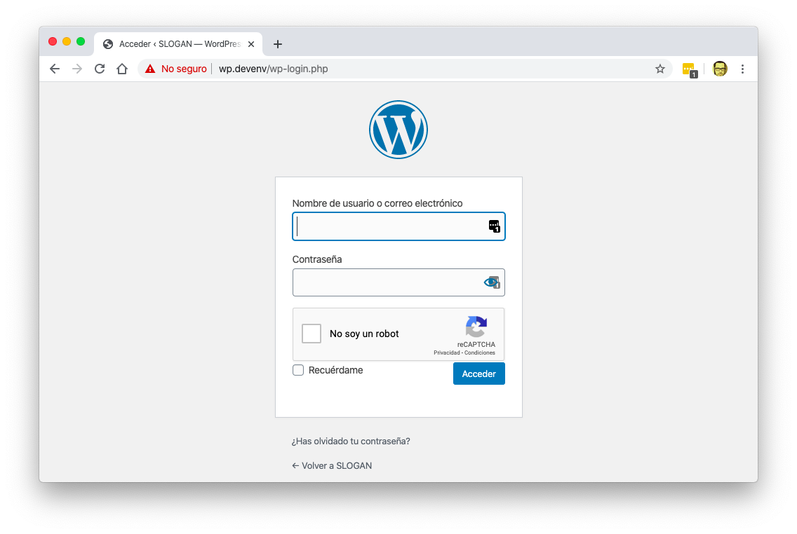

# Wordpress Multisite Recaptcha

A WordPress plugin to add [Google's Recaptcha](https://www.google.com/recaptcha) on every site on a multisite environment.



## Development

The plugin requries that you have installed both [`composer`](https://getcomposer.org) and Node's `npm` globally.

Also, you should have a working WordPress installation.

```bash
cd /path/to/wordpress/wp-content/plugins
git clone git@github.com:marioy47/wordpress-multisite-recaptcha.git
cd wordpress-multisite-recaptcha
composer install
composer dump-autoload
```

**Remember to execute `composer dump-autoload` every time you add or change a class _name_ inside `includes/`**